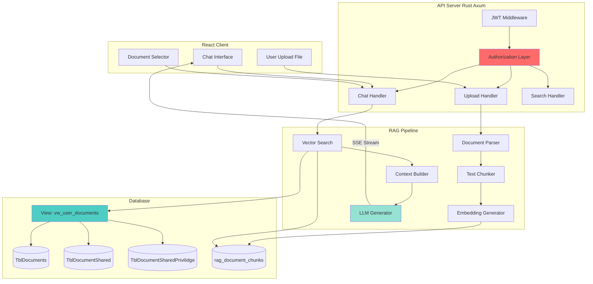

Perfect bro! Sekarang saya buatkan **Full RAG Pipeline API** dengan security layer yang ketat!

***

## 🎯 PART 2: FULL RAG PIPELINE API (Proyek Baru)

### 📋 Project Overview

**Nama Project**: `rag-api-server`

**Tech Stack**:

- **Framework**: Axum (production-grade, SSE support)
- **Database**: PostgreSQL + pgvector + sqlx
- **Security**: JWT + Row-level security
- **Streaming**: SSE (Server-Sent Events)
- **LLM**: llama-server (OpenAI-compatible API)

***

### 🏗️ Architecture Design



***

### 🗄️ Database Setup (Security Layer)

**`database_security_setup.sql`**

```sql


-- ============================================
-- SECURITY VIEW: User Document Access
-- ============================================

-- View untuk mapping user_id ke document_id yang boleh diakses
--DROP VIEW vw_user_documents CASCADE;

CREATE OR REPLACE VIEW vw_user_documents AS
SELECT DISTINCT
    d."Id" as document_id,
    d."Owner" as owner_user_id,
    d."DocumentTitle" as document_title,
    d."InsertedAt"::TIMESTAMPTZ as created_at, 
    COALESCE(dsp."UserID", d."Owner") as user_id,
    CASE 
        WHEN d."Owner" = COALESCE(dsp."UserID", d."Owner") THEN 'owner'
        ELSE 'shared'
    END as permission_level
    
FROM "TblDocuments" d
LEFT JOIN "TblDocumentShared" ds 
    ON ds."DocumentID" = d."Id"
    
LEFT JOIN "TblDocumentSharedPrivillege" dsp 
    ON dsp."DocumentSharedID" = ds."Id"

WHERE 
    d."Owner" IS NOT NULL
    OR
    dsp."UserID" IS NOT NULL;

-- Index untuk performance
CREATE INDEX IF NOT EXISTS idx_vw_user_docs_user_id 
ON "TblDocumentSharedPrivillege"("UserID");

CREATE INDEX IF NOT EXISTS idx_vw_user_docs_document_id 
ON "TblDocuments"("Id");

-- ============================================
-- FUNCTION: Get User's Accessible Document IDs
-- ============================================

CREATE OR REPLACE FUNCTION get_user_document_ids(p_user_id INTEGER)
RETURNS TABLE (document_id INTEGER) AS $$
BEGIN
    RETURN QUERY
    SELECT DISTINCT vud.document_id
    FROM vw_user_documents vud
    WHERE vud.user_id = p_user_id;
END;
$$ LANGUAGE plpgsql STABLE;

-- ============================================
-- FUNCTION: Check User Access to Document
-- ============================================

CREATE OR REPLACE FUNCTION check_user_document_access(
    p_user_id INTEGER,
    p_document_id INTEGER
)
RETURNS BOOLEAN AS $$
BEGIN
    RETURN EXISTS (
        SELECT 1 
        FROM vw_user_documents
        WHERE user_id = p_user_id 
        AND document_id = p_document_id
    );
END;
$$ LANGUAGE plpgsql STABLE;

-- ============================================
-- FUNCTION: Vector Search dengan Authorization
-- ============================================
drop VIEW search_user_documents;

CREATE OR REPLACE FUNCTION search_user_documents(
    p_user_id INTEGER,
    p_query_embedding vector(384),
    p_limit INTEGER DEFAULT 5,
    p_document_id INTEGER DEFAULT NULL  
)
RETURNS TABLE (
    chunk_id BIGINT,
    document_id INTEGER,
    document_title TEXT,
    content TEXT,
    similarity FLOAT,
    chunk_index INTEGER,
    page_number INTEGER
) AS $$
BEGIN
    RETURN QUERY
    SELECT 
        c.id as chunk_id,
        c.document_id,
        d."DocumentTitle" as document_title,
        c.content,
        1 - (c.embedding <=> p_query_embedding) as similarity,
        c.chunk_index,
        c.page_number
    FROM rag_document_chunks c
    
    INNER JOIN vw_user_documents vud 
        ON vud.document_id = c.document_id
        AND vud.user_id = p_user_id
    
    INNER JOIN "TblDocuments" d 
        ON d."Id" = c.document_id
    
    WHERE 
        (p_document_id IS NULL OR c.document_id = p_document_id)
    ORDER BY c.embedding <=> p_query_embedding
    LIMIT p_limit;
END;
$$ LANGUAGE plpgsql STABLE;

-- ============================================
-- FUNCTION: Hybrid Search (Vector + Full-Text)
-- ============================================

CREATE OR REPLACE FUNCTION hybrid_search_user_documents(
    p_user_id INTEGER,
    p_query_embedding vector(384),
    p_query_text TEXT,
    p_limit INTEGER DEFAULT 5,
    p_document_id INTEGER DEFAULT NULL
)
RETURNS TABLE (
    chunk_id BIGINT,
    document_id INTEGER,
    document_title TEXT,
    content TEXT,
    vector_similarity FLOAT,
    text_rank FLOAT,
    hybrid_score FLOAT,
    chunk_index INTEGER
) AS $$
BEGIN
    RETURN QUERY
    SELECT 
        c.id as chunk_id,
        c.document_id,
        d."DocumentTitle" as document_title,
        c.content,
        1 - (c.embedding <=> p_query_embedding) as vector_similarity,
        ts_rank(c.content_tsv, plainto_tsquery('indonesian', p_query_text)) as text_rank,
        (0.7 * (1 - (c.embedding <=> p_query_embedding)) + 
         0.3 * ts_rank(c.content_tsv, plainto_tsquery('indonesian', p_query_text))) as hybrid_score,
        c.chunk_index
    FROM rag_document_chunks c
    
    INNER JOIN vw_user_documents vud 
        ON vud.document_id = c.document_id
        AND vud.user_id = p_user_id
    
    INNER JOIN "TblDocuments" d 
        ON d."Id" = c.document_id
    
    WHERE 
        (p_document_id IS NULL OR c.document_id = p_document_id)
        AND (
            c.embedding <=> p_query_embedding < 0.5
            OR
            c.content_tsv @@ plainto_tsquery('indonesian', p_query_text)
        )
    
    ORDER BY hybrid_score DESC
    LIMIT p_limit;
END;
$$ LANGUAGE plpgsql STABLE;

-- ============================================
-- VERIFICATION
-- ============================================

-- Test view
SELECT * FROM vw_user_documents LIMIT 5;

-- Test function (ganti dengan user_id actual)
SELECT * FROM get_user_document_ids(7);

-- Test access check
SELECT check_user_document_access(7, 123);
```

***

### 📦 Cargo.toml (RAG API Server)

```toml
[package]
name = "rag-api-server"
version = "0.1.0"
edition = "2021"

[dependencies]
# Web framework
axum = { version = "0.7", features = ["macros", "multipart"] }
tower = { version = "0.5", features = ["util"] }
tower-http = { version = "0.6", features = ["fs", "cors", "trace"] }

# Async runtime
tokio = { version = "1.42", features = ["full"] }
futures = "0.3"

# Database
sqlx = { version = "0.8", features = [
    "runtime-tokio-native-tls",
    "postgres",
    "chrono",
    "json",
    "uuid"
] }
pgvector = { version = "0.4", features = ["sqlx"] }

# HTTP client untuk llama-server
reqwest = { version = "0.12", features = ["json", "stream"] }

# Authentication & Security
jsonwebtoken = "9.3"
argon2 = "0.5"
rand = "0.8"

# Serialization
serde = { version = "1.0", features = ["derive"] }
serde_json = "1.0"
toml = "0.8"

# Document processing (reuse dari embedding worker)
lopdf = "0.35"
docx-rs = "0.4"
pulldown-cmark = "0.12"
scraper = "0.21"
encoding_rs = "0.8"
text-splitter = { version = "0.18", features = ["tiktoken-rs"] }

# Error handling
anyhow = "1.0"
thiserror = "1.0"

# Logging
tracing = "0.1"
tracing-subscriber = { version = "0.3", features = ["env-filter", "json"] }

# Configuration
config = "0.14"
dotenvy = "0.15"

# Utilities
chrono = { version = "0.4", features = ["serde"] }
uuid = { version = "1.11", features = ["v4", "serde"] }
bytes = "1.9"
mime_guess = "2.0"
async-trait = "0.1"
once_cell = "1.20"

[dev-dependencies]
mockall = "0.13"

[profile.release]
opt-level = 3
lto = "thin"
codegen-units = 1
strip = true
panic = "abort"
```

***

### 🏗️ Project Structure

```
rag-api-server/
├── Cargo.toml
├── .env.example
├── config/
│   └── settings.toml
├── database_security_setup.sql
├── README.md
└── src/
    ├── main.rs                      # Entry point + Axum server
    ├── lib.rs                       # Library exports
    ├── config/
    │   ├── mod.rs
    │   └── settings.rs              # Configuration
    ├── database/
    │   ├── mod.rs
    │   ├── pool.rs                  # DB connection pool
    │   ├── models.rs                # Database models
    │   └── repository.rs            # Database operations
    ├── auth/
    │   ├── mod.rs
    │   ├── jwt.rs                   # JWT token handling
    │   ├── middleware.rs            # Auth middleware
    │   └── models.rs                # Auth models (User, Claims)
    ├── handlers/
    │   ├── mod.rs
    │   ├── chat.rs                  # Chat endpoint (SSE streaming)
    │   ├── upload.rs                # File upload & processing
    │   ├── search.rs                # Similarity search
    │   └── health.rs                # Health check
    ├── services/
    │   ├── mod.rs
    │   ├── rag_service.rs           # Core RAG logic
    │   ├── embedding_service.rs     # Embedding generation
    │   ├── llm_service.rs           # LLM interaction
    │   └── document_service.rs      # Document processing
    ├── security/
    │   ├── mod.rs
    │   └── authorization.rs         # Document access control
    ├── utils/
    │   ├── mod.rs
    │   ├── error.rs                 # Error types
    │   └── response.rs              # Response builders
    └── document/
        ├── mod.rs
        ├── parser.rs                # Reuse from embedding worker
        └── chunker.rs               # Reuse from embedding worker
```
