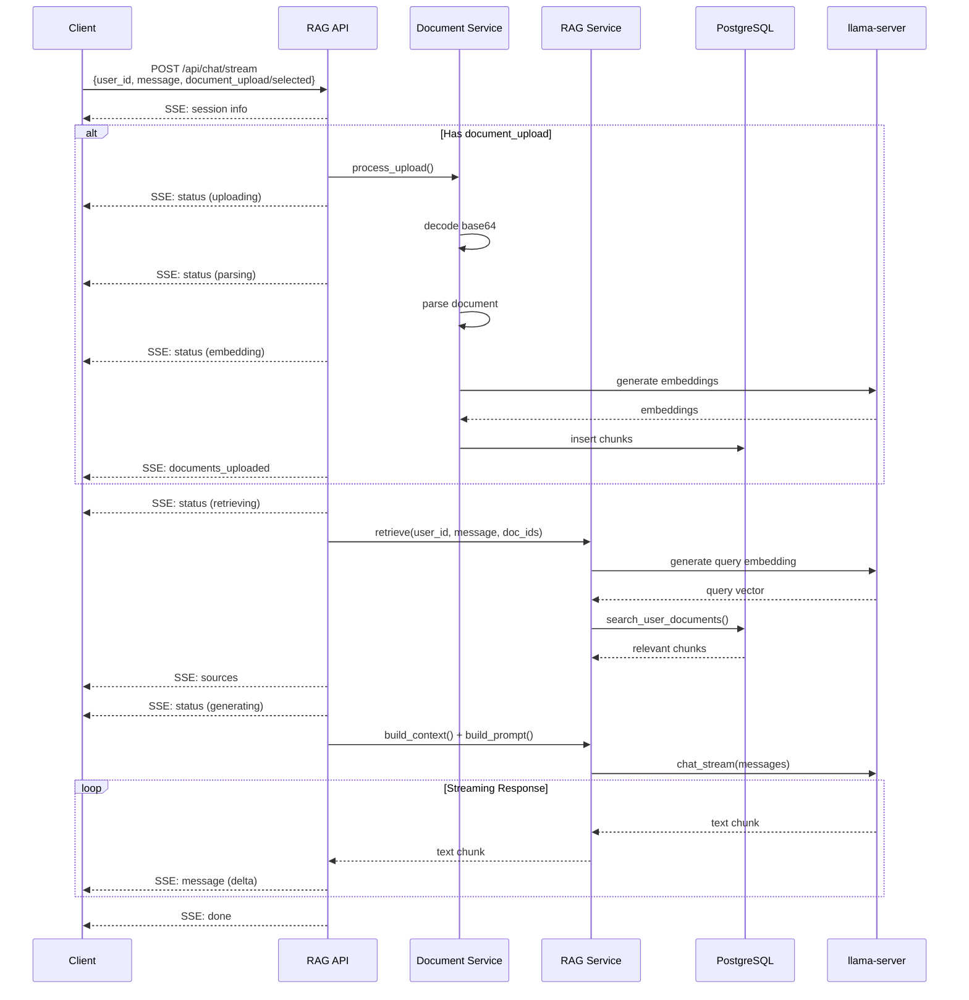

Siap bro! Fokus ke **BACKEND** dan **SIMPLIFY** payload ke essentials saja!

***

## 🎯 SIMPLIFIED: Dynamic Payload Structure (BE Focus)

### 📤 REQUEST PAYLOAD (Simplified)

```typescript
interface ChatRequest {
  // User message
  message: string;
  
  // User identification
  user_id: string;
  
  // Scenario 1: Upload new files (base64 encoded)
  document_upload?: DocumentUpload[];
  
  // Scenario 2: Use specific existing documents
  document_selected?: string[];  // array of document_id
  
  // Optional: Session untuk multi-turn conversation
  session_id?: string;
}

interface DocumentUpload {
  file_name: string;
  file_base64: string;
  file_type: string;  // MIME type: application/pdf, etc
}
```

### 📋 CONTOH REQUEST (3 Skenario)

#### **Skenario 1: Upload File Baru + Chat**

```json
{
  "user_id": "12345",
  "message": "Buatkan summary dari kontrak ini",
  "document_upload": [
    {
      "file_name": "contract_2026.pdf",
      "file_base64": "JVBERi0xLjQKJeLjz9MKMSAwIG9iag...",
      "file_type": "application/pdf"
    }
  ]
}
```

#### **Skenario 2: Chat dengan Dokumen Tertentu**

```json
{
  "user_id": "12345",
  "message": "Berapa nilai kontrak terbesar di Q4?",
  "document_selected": ["456", "789"],
  "session_id": "session-abc-123"
}
```

#### **Skenario 3: General Chat (Semua Dokumen User)**

```json
{
  "user_id": "12345",
  "message": "Apa saja dokumen penting yang perlu saya review bulan ini?",
  "session_id": "session-abc-123"
}
```

***

### 📥 RESPONSE PAYLOAD (SSE Events)

```typescript
// Event 1: Session info
{
  "event": "session",
  "data": {
    "session_id": "uuid-123",
    "user_id": "12345",
    "timestamp": "2026-01-23T21:00:00Z"
  }
}

// Event 2: Processing status
{
  "event": "status",
  "data": {
    "stage": "uploading|parsing|embedding|retrieving|generating",
    "message": "Processing files...",
    "progress": 30
  }
}

// Event 3: Uploaded documents result (jika ada upload)
{
  "event": "documents_uploaded",
  "data": [
    {
      "document_id": 999,
      "file_name": "contract_2026.pdf",
      "status": "success",
      "chunks_created": 45
    }
  ]
}

// Event 4: Retrieved sources
{
  "event": "sources",
  "data": [
    {
      "document_id": 456,
      "document_name": "Q4 Report",
      "chunk_id": 12345,
      "similarity": 0.92,
      "page_number": 3,
      "preview": "Target revenue untuk Q4...",
      "download_url": "/api/documents/456/download",
      "view_url": "/api/documents/456/view?page=3"
    }
  ]
}

// Event 5: AI response streaming
{
  "event": "message",
  "data": {
    "delta": "Berdasarkan dokumen Q4 Report, "
  }
}

// Event 6: Completion
{
  "event": "done",
  "data": {
    "session_id": "uuid-123",
    "message_id": "msg-uuid-999",
    "sources_count": 3,
    "processing_time_ms": 3500
  }
}

// Event 7: Error
{
  "event": "error",
  "data": {
    "code": "DOCUMENT_ACCESS_DENIED",
    "message": "Access denied to document ID: 789"
  }
}
```

***

## 🛠️ BACKEND IMPLEMENTATION (Rust)

### 📁 Updated Models

**`src/models/chat.rs`**

```rust
use serde::{Deserialize, Serialize};
use chrono::{DateTime, Utc};

// ===== REQUEST MODELS =====

#[derive(Debug, Deserialize)]
pub struct ChatRequest {
    pub user_id: String,
    pub message: String,
    #[serde(default)]
    pub document_upload: Option<Vec<DocumentUpload>>,
    #[serde(default)]
    pub document_selected: Option<Vec<String>>,  // document_id array
    #[serde(default)]
    pub session_id: Option<String>,
}

#[derive(Debug, Deserialize)]
pub struct DocumentUpload {
    pub file_name: String,
    pub file_base64: String,
    pub file_type: String,
}

// ===== RESPONSE EVENT MODELS =====

#[derive(Debug, Serialize)]
pub struct SessionInfo {
    pub session_id: String,
    pub user_id: String,
    pub timestamp: DateTime<Utc>,
}

#[derive(Debug, Serialize)]
pub struct StatusInfo {
    pub stage: String,  // uploading, parsing, embedding, retrieving, generating
    pub message: String,
    pub progress: u8,  // 0-100
}

#[derive(Debug, Serialize)]
pub struct UploadedDocInfo {
    pub document_id: i32,
    pub file_name: String,
    pub status: String,  // success, failed
    pub chunks_created: usize,
    #[serde(skip_serializing_if = "Option::is_none")]
    pub error_message: Option<String>,
}

#[derive(Debug, Serialize)]
pub struct SourceInfo {
    pub document_id: i32,
    pub document_name: String,
    pub chunk_id: i64,
    pub similarity: f32,
    pub page_number: Option<i32>,
    pub preview: String,  // first 150 chars
    pub download_url: String,
    pub view_url: String,
}

#[derive(Debug, Serialize)]
pub struct MessageChunk {
    pub delta: String,  // streaming text chunk
}

#[derive(Debug, Serialize)]
pub struct CompletionInfo {
    pub session_id: String,
    pub message_id: String,
    pub sources_count: usize,
    pub processing_time_ms: u64,
}

#[derive(Debug, Serialize)]
pub struct ErrorInfo {
    pub code: String,
    pub message: String,
}
```

***

### 🎯 Main Chat Handler

**`src/handlers/chat.rs`**

```rust
use crate::models::chat::*;
use crate::security::DocumentAuthorization;
use crate::services::{DocumentService, RagService};
use crate::utils::error::ApiError;
use axum::{
    extract::Extension,
    response::sse::{Event, KeepAlive, Sse},
    Json,
};
use futures::stream::Stream;
use std::convert::Infallible;
use std::sync::Arc;
use std::time::Instant;
use tracing::{debug, info, warn};

pub async fn chat_stream_handler(
    Extension(rag_service): Extension<Arc<RagService>>,
    Extension(document_service): Extension<Arc<DocumentService>>,
    Extension(doc_auth): Extension<Arc<DocumentAuthorization>>,
    Json(request): Json<ChatRequest>,
) -> Result<Sse<impl Stream<Item = Result<Event, Infallible>>>, ApiError> {
    
    let start_time = Instant::now();
    
    // Parse user_id
    let user_id: i32 = request.user_id.parse()
        .map_err(|_| ApiError::BadRequest("Invalid user_id format".to_string()))?;
    
    let session_id = request.session_id
        .unwrap_or_else(|| uuid::Uuid::new_v4().to_string());
    
    info!(
        "Chat request: user={}, session={}, message_len={}, has_upload={}, has_selected={}",
        user_id,
        session_id,
        request.message.len(),
        request.document_upload.is_some(),
        request.document_selected.is_some()
    );
    
    // Clone untuk move into async stream
    let session_id_clone = session_id.clone();
    let message = request.message.clone();
    let document_upload = request.document_upload.clone();
    let document_selected = request.document_selected.clone();
    
    // Create SSE stream
    let stream = async_stream::stream! {
        // ===== EVENT 1: Session Info =====
        yield Ok(create_sse_event("session", &SessionInfo {
            session_id: session_id_clone.clone(),
            user_id: user_id.to_string(),
            timestamp: chrono::Utc::now(),
        }));
        
        let mut uploaded_doc_ids: Vec<i32> = Vec::new();
        
        // ===== STEP 1: Handle Document Uploads (if any) =====
        if let Some(uploads) = document_upload {
            info!("Processing {} uploaded files", uploads.len());
            
            yield Ok(create_sse_event("status", &StatusInfo {
                stage: "uploading".to_string(),
                message: format!("Processing {} file(s)...", uploads.len()),
                progress: 10,
            }));
            
            let mut uploaded_results = Vec::new();
            
            for (idx, upload) in uploads.iter().enumerate() {
                debug!("Processing file {}/{}: {}", idx + 1, uploads.len(), upload.file_name);
                
                // Decode base64
                let file_data = match base64::decode(&upload.file_base64) {
                    Ok(data) => data,
                    Err(e) => {
                        warn!("Failed to decode base64 for {}: {}", upload.file_name, e);
                        uploaded_results.push(UploadedDocInfo {
                            document_id: 0,
                            file_name: upload.file_name.clone(),
                            status: "failed".to_string(),
                            chunks_created: 0,
                            error_message: Some(format!("Invalid base64: {}", e)),
                        });
                        continue;
                    }
                };
                
                yield Ok(create_sse_event("status", &StatusInfo {
                    stage: "parsing".to_string(),
                    message: format!("Parsing {}...", upload.file_name),
                    progress: 20 + ((idx as u8 * 20) / uploads.len() as u8),
                }));
                
                // Process document
                match document_service
                    .process_upload(user_id, upload.file_name.clone(), file_data)
                    .await
                {
                    Ok((document_id, chunks_count)) => {
                        info!("Document {} processed: id={}, chunks={}", 
                            upload.file_name, document_id, chunks_count);
                        
                        uploaded_doc_ids.push(document_id);
                        
                        uploaded_results.push(UploadedDocInfo {
                            document_id,
                            file_name: upload.file_name.clone(),
                            status: "success".to_string(),
                            chunks_created: chunks_count,
                            error_message: None,
                        });
                    }
                    Err(e) => {
                        warn!("Failed to process {}: {}", upload.file_name, e);
                        
                        uploaded_results.push(UploadedDocInfo {
                            document_id: 0,
                            file_name: upload.file_name.clone(),
                            status: "failed".to_string(),
                            chunks_created: 0,
                            error_message: Some(e.to_string()),
                        });
                    }
                }
            }
            
            // Send upload results
            yield Ok(create_sse_event("documents_uploaded", &uploaded_results));
        }
        
        // ===== STEP 2: Determine Document Scope =====
        let target_document_ids: Option<Vec<i32>> = if !uploaded_doc_ids.is_empty() {
            // Use uploaded documents
            Some(uploaded_doc_ids)
        } else if let Some(selected) = document_selected {
            // Use selected documents
            let parsed: Vec<i32> = selected
                .iter()
                .filter_map(|id| id.parse().ok())
                .collect();
            
            if parsed.is_empty() {
                yield Ok(create_sse_event("error", &ErrorInfo {
                    code: "INVALID_DOCUMENT_IDS".to_string(),
                    message: "Invalid document IDs provided".to_string(),
                }));
                return;
            }
            
            // Verify access to all selected documents
            for doc_id in &parsed {
                match doc_auth.check_access(user_id, *doc_id).await {
                    Ok(true) => {},
                    Ok(false) => {
                        yield Ok(create_sse_event("error", &ErrorInfo {
                            code: "DOCUMENT_ACCESS_DENIED".to_string(),
                            message: format!("Access denied to document ID: {}", doc_id),
                        }));
                        return;
                    }
                    Err(e) => {
                        yield Ok(create_sse_event("error", &ErrorInfo {
                            code: "DATABASE_ERROR".to_string(),
                            message: format!("Failed to check access: {}", e),
                        }));
                        return;
                    }
                }
            }
            
            Some(parsed)
        } else {
            // General chat - use all user's documents
            None
        };
        
        debug!("Document scope: {:?}", target_document_ids);
        
        // ===== STEP 3: Retrieve Relevant Context =====
        yield Ok(create_sse_event("status", &StatusInfo {
            stage: "retrieving".to_string(),
            message: "Searching relevant documents...".to_string(),
            progress: 50,
        }));
        
        let document_id_for_search = target_document_ids.as_ref().and_then(|ids| ids.first().copied());
        
        let chunks = match rag_service
            .retrieve(user_id, &message, document_id_for_search)
            .await
        {
            Ok(chunks) => chunks,
            Err(e) => {
                yield Ok(create_sse_event("error", &ErrorInfo {
                    code: "RETRIEVAL_ERROR".to_string(),
                    message: format!("Failed to retrieve context: {}", e),
                }));
                return;
            }
        };
        
        if chunks.is_empty() {
            yield Ok(create_sse_event("error", &ErrorInfo {
                code: "NO_RELEVANT_CONTEXT".to_string(),
                message: "Tidak ditemukan informasi yang relevan dalam dokumen Anda.".to_string(),
            }));
            return;
        }
        
        info!("Retrieved {} relevant chunks", chunks.len());
        
        // ===== EVENT 4: Send Sources =====
        let sources: Vec<SourceInfo> = chunks
            .iter()
            .map(|chunk| SourceInfo {
                document_id: chunk.document_id,
                document_name: chunk.document_title.clone(),
                chunk_id: chunk.chunk_id,
                similarity: chunk.similarity,
                page_number: chunk.page_number,
                preview: chunk.content.chars().take(150).collect::<String>(),
                download_url: format!("/api/documents/{}/download", chunk.document_id),
                view_url: format!("/api/documents/{}/view?page={}", 
                    chunk.document_id,
                    chunk.page_number.unwrap_or(1)
                ),
            })
            .collect();
        
        yield Ok(create_sse_event("sources", &sources));
        
        // ===== STEP 4: Generate AI Response =====
        yield Ok(create_sse_event("status", &StatusInfo {
            stage: "generating".to_string(),
            message: "Generating response...".to_string(),
            progress: 70,
        }));
        
        let context = rag_service.build_context(chunks);
        let llm_messages = rag_service.build_prompt(&message, &context);
        
        let mut llm_stream = match rag_service.llm_service.chat_stream(llm_messages).await {
            Ok(stream) => stream,
            Err(e) => {
                yield Ok(create_sse_event("error", &ErrorInfo {
                    code: "LLM_ERROR".to_string(),
                    message: format!("Failed to generate response: {}", e),
                }));
                return;
            }
        };
        
        // ===== EVENT 5: Stream AI Response =====
        use futures::StreamExt;
        
        while let Some(result) = llm_stream.next().await {
            match result {
                Ok(content) => {
                    if !content.is_empty() {
                        yield Ok(create_sse_event("message", &MessageChunk {
                            delta: content,
                        }));
                    }
                }
                Err(e) => {
                    yield Ok(create_sse_event("error", &ErrorInfo {
                        code: "LLM_STREAM_ERROR".to_string(),
                        message: format!("Streaming error: {}", e),
                    }));
                    break;
                }
            }
        }
        
        // ===== EVENT 6: Completion =====
        let processing_time = start_time.elapsed().as_millis() as u64;
        
        yield Ok(create_sse_event("done", &CompletionInfo {
            session_id: session_id_clone,
            message_id: uuid::Uuid::new_v4().to_string(),
            sources_count: sources.len(),
            processing_time_ms: processing_time,
        }));
        
        info!("Chat completed in {}ms", processing_time);
    };
    
    Ok(Sse::new(stream).keep_alive(KeepAlive::default()))
}

// Helper: Create SSE event
fn create_sse_event<T: serde::Serialize>(event_type: &str, data: &T) -> Event {
    Event::default()
        .event(event_type)
        .data(serde_json::to_string(data).unwrap_or_else(|_| "{}".to_string()))
}
```

***

### 📄 Updated Document Service

**`src/services/document_service.rs`**

```rust
use crate::database::Repository;
use crate::document::{chunker::TextChunker, parser::DocumentParser};
use crate::services::EmbeddingService;
use crate::utils::error::ApiError;
use anyhow::Result;
use pgvector::Vector;
use std::sync::Arc;
use tracing::{debug, info, warn};

pub struct DocumentService {
    repository: Arc<Repository>,
    embedding_service: Arc<EmbeddingService>,
    chunk_size: usize,
    chunk_overlap: usize,
}

impl DocumentService {
    pub fn new(repository: Arc<Repository>, embedding_service: Arc<EmbeddingService>) -> Self {
        Self {
            repository,
            embedding_service,
            chunk_size: 512,
            chunk_overlap: 50,
        }
    }
    
    /// Process uploaded file: decode -> parse -> chunk -> embed -> save
    pub async fn process_upload(
        &self,
        user_id: i32,
        filename: String,
        file_data: Vec<u8>,
    ) -> Result<(i32, usize), ApiError> {
        info!("Processing upload: {} ({} bytes)", filename, file_data.len());
        
        // 1. Detect file type
        let file_type = self.detect_file_type(&filename)?;
        debug!("Detected file type: {}", file_type);
        
        // 2. Parse document
        let content = self.parse_document(&file_data, &file_type).await?;
        debug!("Extracted {} characters", content.len());
        
        if content.trim().is_empty() {
            return Err(ApiError::BadRequest(
                "No text content found in document".to_string(),
            ));
        }
        
        // 3. Chunk text
        let chunks = self.chunk_text(&content)?;
        info!("Created {} chunks", chunks.len());
        
        if chunks.is_empty() {
            return Err(ApiError::BadRequest("Failed to create chunks".to_string()));
        }
        
        // 4. Generate embeddings (batch)
        let texts: Vec<String> = chunks.clone();
        let embeddings = self.embedding_service.embed_batch(texts).await?;
        debug!("Generated {} embeddings", embeddings.len());
        
        // 5. Create document record in TblDocuments
        let document_id = self.create_document_record(user_id, &filename).await?;
        info!("Created document record: id={}", document_id);
        
        // 6. Save chunks to rag_document_chunks
        let chunk_data: Vec<(String, Vector)> = chunks
            .into_iter()
            .zip(embeddings.into_iter())
            .map(|(content, embedding)| (content, Vector::from(embedding)))
            .collect();
        
        self.repository
            .insert_document_chunks(document_id, chunk_data)
            .await
            .map_err(|e| ApiError::DatabaseError(e.to_string()))?;
        
        info!("Document {} processed successfully with {} chunks", document_id, chunks.len());
        
        Ok((document_id, chunks.len()))
    }
    
    fn detect_file_type(&self, filename: &str) -> Result<String, ApiError> {
        let extension = std::path::Path::new(filename)
            .extension()
            .and_then(|e| e.to_str())
            .ok_or_else(|| ApiError::BadRequest("No file extension found".to_string()))?
            .to_lowercase();
        
        match extension.as_str() {
            "pdf" => Ok("pdf".to_string()),
            "docx" | "doc" => Ok("docx".to_string()),
            "txt" => Ok("text".to_string()),
            "md" => Ok("markdown".to_string()),
            "html" | "htm" => Ok("html".to_string()),
            _ => Err(ApiError::BadRequest(format!(
                "Unsupported file type: {}",
                extension
            ))),
        }
    }
    
    async fn parse_document(&self, data: &[u8], file_type: &str) -> Result<String, ApiError> {
        // Save to temp file
        let temp_dir = std::env::temp_dir();
        let temp_file = temp_dir.join(format!("upload_{}.{}", uuid::Uuid::new_v4(), file_type));
        
        tokio::fs::write(&temp_file, data)
            .await
            .map_err(|e| ApiError::InternalError(format!("Failed to write temp file: {}", e)))?;
        
        // Parse
        let parsed = DocumentParser::parse(&temp_file)
            .map_err(|e| ApiError::InternalError(format!("Failed to parse document: {}", e)))?;
        
        // Cleanup
        let _ = tokio::fs::remove_file(&temp_file).await;
        
        Ok(parsed.content)
    }
    
    fn chunk_text(&self, text: &str) -> Result<Vec<String>, ApiError> {
        let chunker = TextChunker::new(self.chunk_size, self.chunk_overlap);
        
        let chunks = chunker
            .chunk(text)
            .map_err(|e| ApiError::InternalError(format!("Failed to chunk text: {}", e)))?;
        
        Ok(chunks.into_iter().map(|c| c.content).collect())
    }
    
    async fn create_document_record(&self, user_id: i32, filename: &str) -> Result<i32, ApiError> {
        // TODO: Real implementation - insert ke TblDocuments
        // Untuk sekarang, generate temporary ID
        let document_id = (chrono::Utc::now().timestamp() % 100000) as i32;
        
        info!(
            "Document record created: id={}, user={}, filename={}",
            document_id, user_id, filename
        );
        
        Ok(document_id)
    }
}
```

***

### 🔧 Updated Main.rs

**`src/main.rs` (partial - tambahkan DocumentService)**

```rust
// ... existing imports ...

use services::DocumentService;

#[tokio::main]
async fn main() -> Result<()> {
    // ... existing setup ...
    
    // Initialize services
    let document_service = Arc::new(DocumentService::new(
        repository.clone(),
        embedding_service.clone(),
    ));
    
    // Build router
    let app = build_router(
        rag_service,
        embedding_service,
        document_service,  // <-- ADD THIS
        document_auth,
        ip_whitelist,
        header_validator,
    );
    
    // ... rest of main ...
}

fn build_router(
    rag_service: Arc<RagService>,
    embedding_service: Arc<EmbeddingService>,
    document_service: Arc<DocumentService>,  // <-- ADD THIS
    document_auth: Arc<DocumentAuthorization>,
    ip_whitelist: Arc<IpWhitelist>,
    header_validator: Arc<CustomHeaderValidator>,
) -> Router {
    // ... existing routes ...
    
    let protected_routes = Router::new()
        .route("/api/chat/stream", post(handlers::chat::chat_stream_handler))
        // ... other routes ...
        .layer(Extension(rag_service))
        .layer(Extension(embedding_service))
        .layer(Extension(document_service))  // <-- ADD THIS
        .layer(Extension(document_auth.clone()))
        .layer(middleware::from_fn(security::middleware::security_middleware))
        .layer(Extension(ip_whitelist))
        .layer(Extension(header_validator));
    
    // ... rest of router ...
}
```

***

### 📊 Flow Diagram (Updated)



***
