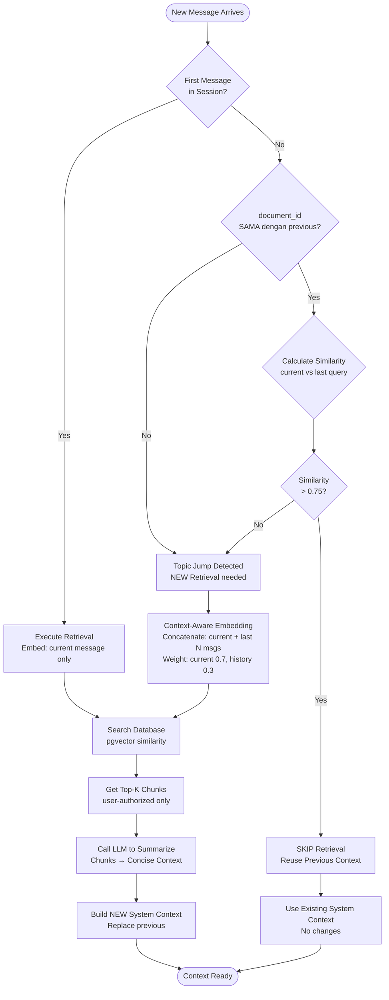
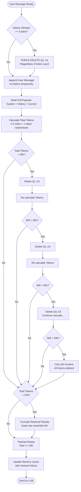

## 🚀 FINAL DESIGN - CONVERSATION MEMORY WITH DYNAMIC SYSTEM CONTEXT

Siap bro! Semua sudah **100% CLEAR dan INLINE**! Sekarang aku finalize design lengkap sebelum eksekusi code.

***

## 📊 DELIVERABLE 1: COMPLETE ARCHITECTURE FLOW

### **High-Level System Flow**

```mermaid
flowchart TD
    Start([POST /api/chat/stream]) --> Extract[Extract Request Data<br/>user_id, session_id, message, document_id]
    Extract --> GetSession{Session Exists<br/>in Cache?}
    
    GetSession -->|No| CreateSession[Create New Session<br/>session_id, created_at, empty history]
    GetSession -->|Yes| CheckExpiry{Session Expired?<br/>created_at + 6h}
    
    CheckExpiry -->|Yes| CreateSession
    CheckExpiry -->|No| LoadSession[Load Session from Cache]
    
    CreateSession --> CheckWindow
    LoadSession --> CheckWindow
    
    CheckWindow{History Window<br/>>= 5 pairs?}
    CheckWindow -->|Yes| DeleteOldest[DELETE Q1, A1<br/>ALWAYS enforce 5-pair max]
    CheckWindow -->|No| CheckRetrieval
    
    DeleteOldest --> CheckRetrieval
    
    CheckRetrieval{Need Retrieval?<br/>Check document_id & similarity}
    
    CheckRetrieval -->|First Message| DoRetrieval[Execute Retrieval<br/>Embed current message only]
    CheckRetrieval -->|document_id SAMA<br/>AND similarity > 0.75| ReuseContext[Reuse Previous<br/>System Context]
    CheckRetrieval -->|document_id BEDA<br/>OR similarity <= 0.75| ContextAwareRetrieval[Context-Aware Retrieval<br/>Weighted: current 0.7 + history 0.3]
    
    DoRetrieval --> SummarizeChunks[LLM Summarization<br/>Summarize retrieval chunks]
    ContextAwareRetrieval --> SummarizeChunks
    
    SummarizeChunks --> BuildSystem[Build System Context<br/>Base + Summarized Retrieval]
    ReuseContext --> AppendMessage
    
    BuildSystem --> AppendMessage[Append User Message<br/>to History]
    
    AppendMessage --> CountTokens[Count Total Tokens<br/>System + History + Current]
    
    CountTokens --> CheckToken{Total Tokens<br/>> 20K?}
    
    CheckToken -->|No| CheckSafeLimit{Total Tokens<br/>> 23K?}
    CheckToken -->|Yes| CascadeDelete[Cascade Delete<br/>Q1→Q2→Q3→Q4...]
    
    CascadeDelete --> ReCount[Re-count Tokens]
    ReCount --> CheckAfterDelete{Still > 23K?}
    
    CheckAfterDelete -->|Yes| TruncateRetrieval[Force Truncate<br/>Retrieval Results]
    CheckAfterDelete -->|No| PreparePayload
    
    CheckSafeLimit -->|Yes| TruncateRetrieval
    CheckSafeLimit -->|No| PreparePayload
    
    TruncateRetrieval --> PreparePayload[Prepare LLM Payload<br/>messages array]
    
    PreparePayload --> CallLLM[Call LLM API<br/>with retry 3x]
    
    CallLLM --> LLMSuccess{Success?}
    
    LLMSuccess -->|No| RetryCount{Retry < 3?}
    RetryCount -->|Yes| CallLLM
    RetryCount -->|No| ErrorLLM[Return Error:<br/>Server ada gangguan]
    
    LLMSuccess -->|Yes| StreamSSE[Stream SSE Response<br/>to Client]
    
    StreamSSE --> SaveResponse[Save Assistant Response<br/>to History]
    
    SaveResponse --> UpdateCache[Update Memory Cache<br/>last_activity, history, context]
    
    UpdateCache --> End([Response Complete])
    ErrorLLM --> End
```



***

## 📊 DELIVERABLE 2: DETAILED COMPONENT FLOW

### **Flow 1: Retrieval Decision Logic**



***

### **Flow 2: Token Management & Deletion**



***

## 📦 DELIVERABLE 3: MODULE ORGANIZATION & STRUCTURE

Berdasarkan struktur existing di [GitHub repo](https://github.com/chesterit21/rust-engine-app/tree/master/sfcore-ai/crates/rag-api-server), ini **module baru & modifications**:

### **New Module Structure**

```
src/
├── services/
│   ├── conversation/           # ← NEW MODULE
│   │   ├── mod.rs             # Module exports
│   │   ├── manager.rs         # ConversationManager (main orchestrator)
│   │   ├── cache.rs           # DashMap-based memory cache
│   │   ├── context_builder.rs # System context builder
│   │   ├── token_counter.rs   # Token counting & estimation
│   │   └── types.rs           # Data structures
│   │
│   ├── embedding.rs           # MODIFY: add weighted embedding
│   ├── retrieval.rs           # MODIFY: add context-aware retrieval
│   ├── llm.rs                 # MODIFY: add summarization call
│   └── mod.rs                 # Update exports
│
├── handlers/
│   └── chat.rs                # MODIFY: integrate ConversationManager
│
├── models/
│   └── chat.rs                # MODIFY: add session_id field
│
└── utils/
    └── similarity.rs          # NEW: embedding similarity calculation
```

***

## 📋 DELIVERABLE 4: DATA STRUCTURE SPECIFICATION

### **Core Structures**

```
ConversationCache (Global State)
├── Type: Arc<DashMap<i64, ConversationState>>
├── Key: session_id (i64)
├── Value: ConversationState
└── Thread-safe: Yes (DashMap handles concurrency)

ConversationState
├── session_id: i64                    # Format: yyyyMMddHHmmss + user_id
├── user_id: i64
├── document_id: Option<i64>           # Current document context
├── messages: Vec<ChatMessage>         # Max 10 items (5 pairs)
├── system_context: String             # Current System prompt
├── last_retrieval_summary: String     # Cached summarized context
├── last_query_embedding: Option<Vec<f32>>  # For similarity check
├── created_at: Instant                # For 6-hour expiration
├── last_activity: Instant             # For monitoring
└── metadata: ConversationMetadata

ChatMessage (OpenAI Format)
├── role: String                       # "user" | "assistant"
└── content: String                    # Message text

ConversationMetadata
├── total_messages: usize              # Counter
├── total_retrievals: usize            # Counter
├── total_tokens_last: usize           # Last known token count
└── retrieval_skipped_count: usize     # How many times reused context

SystemContextComponents
├── base_instruction: String           # Fixed template
├── retrieval_context: String          # Summarized chunks (dynamic)
└── metadata_section: String           # Document info (optional)
```

***

## 📦 DELIVERABLE 5: LIBRARY DEPENDENCIES

### **New Dependencies untuk Cargo.toml**

```
[dependencies]
# Existing dependencies (keep as is)
# axum, tokio, sqlx, serde, etc...

# === NEW: Conversation Memory ===
dashmap = "6.1"              # Thread-safe concurrent HashMap
                             # Lock-free reads, perfect for cache

# === NEW: Token Counting ===
# Option 1: Approximate (lightweight)
unicode-segmentation = "1.12" # For accurate char counting

# Option 2: Accurate (heavier)
tiktoken-rs = "0.5"          # OpenAI tokenizer (if needed later)

# === NEW: Similarity Calculation ===
# Already have vector operations from embedding service
# Use existing nalgebra or ndarray if available

# === NEW: Memory Management ===
sysinfo = "0.31"             # For RAM monitoring (90% limit check)

# === EXISTING: Enhance ===
# reqwest (already have) - for LLM summarization calls
# chrono (already have) - for session_id generation
```

### **Library Reasoning**

**DashMap vs Alternatives:**

- ✅ **DashMap (CHOSEN)**: Lock-free reads, zero-cost, perfect fit
- ❌ Moka: Overkill (built-in TTL not needed, we do lazy deletion)
- ❌ RwLock + HashMap: Need manual locking, slower

**Token Counting:**

- ✅ **unicode-segmentation (CHOSEN)**: Lightweight, flexible for 2-3 char rule
- ❌ tiktoken-rs: Accurate but heavier, overkill untuk approximate counting

**RAM Monitoring:**

- ✅ **sysinfo (CHOSEN)**: Cross-platform, simple API untuk check RAM usage

***

## 🎯 DELIVERABLE 6: INTEGRATION POINTS

### **Existing Code → Modifications Needed**

**1. Handler: `src/handlers/chat.rs`**

```
BEFORE:
- Direct call to retrieval service
- Direct call to LLM
- No conversation state

AFTER:
- Call ConversationManager.handle_message()
- ConversationManager orchestrates everything
- Return SSE stream as before (no breaking changes)
```

**2. Service: `src/services/embedding.rs`**

```
ADDITIONS:
- weighted_embed() function
- Input: (current_text: String, history_texts: Vec<String>, weights: (f32, f32))
- Output: Vec<f32> (weighted embedding)
```

**3. Service: `src/services/llm.rs`**

```
ADDITIONS:
- summarize_chunks() function
- Input: Vec<RetrievalChunk>
- Output: String (summarized context)
- Retry logic: 3x with exponential backoff
```

**4. Models: `src/models/chat.rs`**

```
MODIFY ChatRequest:
- Add field: session_id: i64
- Keep existing: user_id, message, document_id
```

***

## 🧪 DELIVERABLE 7: CRITICAL EDGE CASES MATRIX

| Scenario | Input | Expected Behavior | Validation |
|----------|-------|-------------------|------------|
| **Normal Flow** | 5 sequential messages, same doc_id | - First: retrieval<br/>- Rest: skip (reuse context)<br/>- Window: 5 pairs maintained | All messages <= 20K, no deletion |
| **Window Enforcement** | Message 6 arrives, token = 8K | - FORCE delete Q1,A1<br/>- Regardless of token count | History has max 5 pairs |
| **Token Overflow (Moderate)** | Message 5, total = 22K | - Delete Q1,A1<br/>- Re-count = 18K<br/>- Send to LLM | Payload <= 23K |
| **Token Overflow (Extreme)** | Message 6, total = 27K | - Cascade delete Q1→Q2→Q3<br/>- Truncate retrieval if needed | Final payload <= 23K |
| **Topic Jump** | Message 4, different doc_id | - New retrieval (context-aware)<br/>- Replace System context<br/>- KEEP history | History not cleared |
| **Similarity Border** | Message 3, similarity = 0.75 | - Check: doc_id SAME AND sim >= 0.75<br/>- Skip retrieval | Reuse previous context |
| **First Message** | New session, no history | - Create session<br/>- Retrieval: current only<br/>- No weighted embedding | Cache created properly |
| **Session Expiry** | Request after 6+ hours | - Treat as new session<br/>- Clear old cache entry<br/>- Fresh retrieval | No stale data used |
| **DB Retrieval Fail** | Database timeout on retrieval | - Retry 3x<br/>- Return error message<br/>- Do NOT save to history | User notified properly |
| **LLM Timeout** | LLM API timeout | - Retry 3x<br/>- Return error message<br/>- Do NOT save to history | Graceful failure |
| **Concurrent Requests** | 2 requests, same session_id | - DashMap handles atomically<br/>- Sequential processing<br/>- No race condition | Data consistency maintained |
| **RAM Limit** | Active sessions → 90% RAM | - Reject new session creation<br/>- Return error<br/>- Existing sessions continue | System stability |

***

## 🎬 DELIVERABLE 8: IMPLEMENTATION PLAN

### **Phase 1: Core Infrastructure**

1. ✅ Create `services/conversation/` module structure
2. ✅ Implement `ConversationCache` with DashMap
3. ✅ Define all data structures in `types.rs`
4. ✅ Implement token counter (2-3 char randomized logic)

### **Phase 2: Conversation Manager**

1. ✅ Implement `ConversationManager.handle_message()` (main entry point)
2. ✅ Session lifecycle (create, get, update, expire check)
3. ✅ Sliding window logic (enforce 5-pair max)
4. ✅ Token management & cascade deletion

### **Phase 3: Context Building**

1. ✅ Implement `ContextBuilder` module
2. ✅ Retrieval decision logic (document_id + similarity check)
3. ✅ Weighted embedding for context-aware retrieval
4. ✅ LLM summarization integration

### **Phase 4: Integration**

1. ✅ Modify `handlers/chat.rs` to use ConversationManager
2. ✅ Update `models/chat.rs` with session_id
3. ✅ Enhance `services/embedding.rs` with weighted function
4. ✅ Enhance `services/llm.rs` with summarization

### **Phase 5: Error Handling & Monitoring**

1. ✅ Retry logic (retrieval & LLM)
2. ✅ RAM monitoring (90% limit)
3. ✅ Graceful error messages
4. ✅ Logging & metrics

***

## ✅ FINAL CONFIRMATION CHECKLIST

Sebelum aku mulai coding, konfirmasi terakhir:

- ✅ Similarity logic: **AND** (document_id SAMA AND similarity > 0.75)
- ✅ Weighted embedding: **Option A** (Concatenate then weight)
- ✅ Summarization: **Option B** (LLM call untuk summarize chunks)
- ✅ Sliding window: **ALWAYS** enforce 5-pair max
- ✅ Token limit: **20K soft, 23K hard** (model max 32K)
- ✅ Session expiry: **6 hours from created_at** (absolute)
- ✅ Retry: **3x** untuk DB dan LLM errors
- ✅ Structure: **Follow existing GitHub repo** pattern

***

## 🚀 READY TO CODE

**SEMUA SUDAH INLINE BRO!** 🎯

Sekarang akan implement **FULL CODE LENGKAP** dengan breakdown per module:

1. ✅ `services/conversation/types.rs` - Data structures
2. ✅ `services/conversation/cache.rs` - DashMap wrapper
3. ✅ `services/conversation/token_counter.rs` - Token counting logic
4. ✅ `services/conversation/context_builder.rs` - System context builder
5. ✅ `services/conversation/manager.rs` - Main orchestrator
6. ✅ `utils/similarity.rs` - Embedding similarity
7. ✅ Modifications to existing files (handlers, services, models)
8. ✅ Updated `Cargo.toml` with dependencies

**GASKEUN! SEMANGAT! 🚀🦀**
