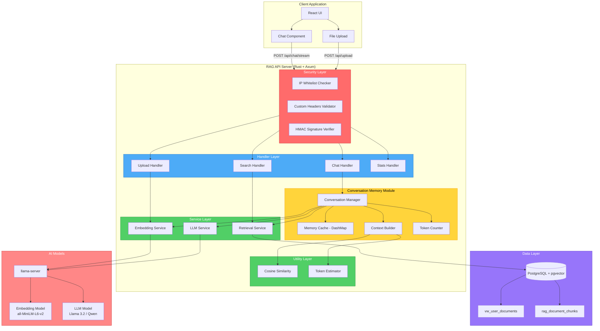
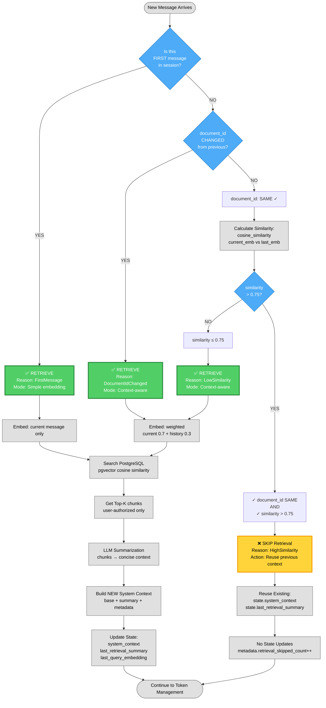
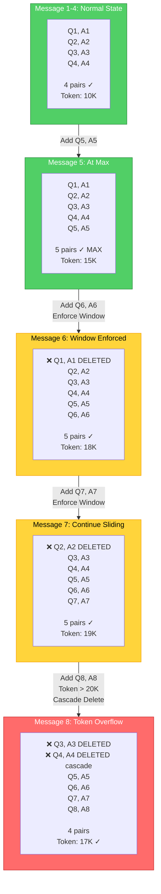
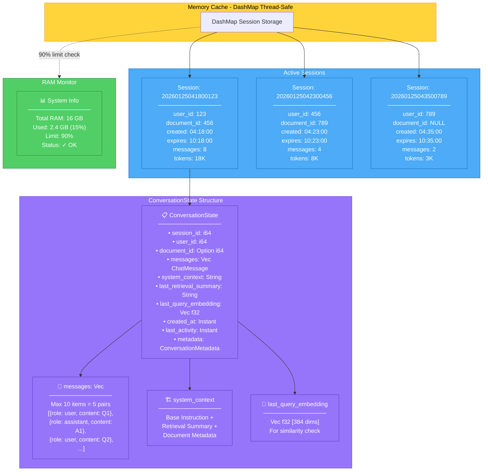
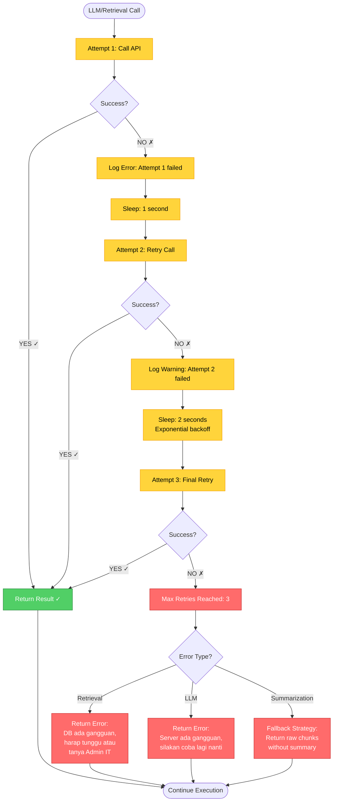
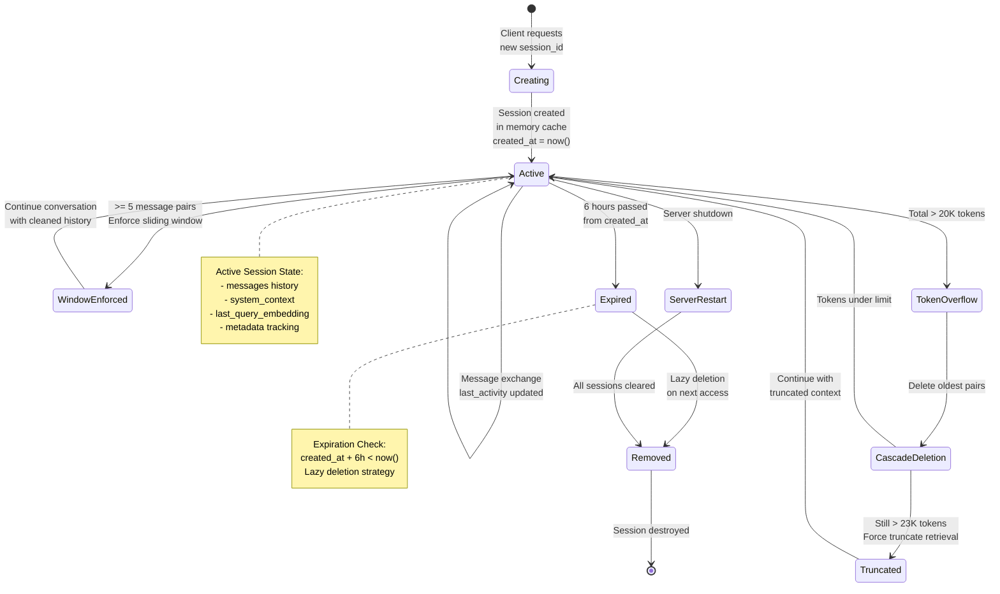

## 📊 MERMAID DIAGRAM FLOW LENGKAP UNTUK DOKUMENTASI

***

## 🎨 DIAGRAM 1: HIGH-LEVEL SYSTEM ARCHITECTURE



***

## 🎨 DIAGRAM 2: DETAILED MESSAGE FLOW (COMPLETE LIFECYCLE)

```mermaid
sequenceDiagram
    autonumber
    participant Client as 👤 Client
    participant Security as 🔐 Security Middleware
    participant Handler as 🎯 Chat Handler
    participant Manager as 🧠 Conversation Manager
    participant Cache as 💾 Memory Cache
    participant Window as 📏 Sliding Window
    participant Context as 🏗️ Context Builder
    participant Token as 🔢 Token Counter
    participant Embed as 🎨 Embedding Service
    participant Retrieval as 🔍 Retrieval Service
    participant LLM as 🤖 LLM Service
    participant DB as 🗄️ PostgreSQL

    %% Request Phase
    Client->>Security: POST /api/chat/stream<br/>{session_id, user_id, message, doc_id}
    Security->>Security: ✓ IP Whitelist Check
    Security->>Security: ✓ Custom Headers Validation
    Security->>Security: ✓ Timestamp & HMAC Verify
    Security->>Handler: Request Authorized ✓

    %% Session Management Phase
    Handler->>Manager: handle_message(session_id, user_id, message, doc_id)
    Manager->>Cache: get_or_create_session(session_id)
    
    alt Session Exists & Not Expired
        Cache-->>Manager: Return ConversationState
    else New Session or Expired
        Cache->>Cache: Check RAM Usage (must be < 90%)
        Cache->>Cache: Create New ConversationState
        Cache-->>Manager: Return New State
    end

    %% Sliding Window Enforcement
    Manager->>Window: enforce_sliding_window(state)
    Window->>Window: Check: message_pairs >= 5?
    
    alt >= 5 Pairs (ALWAYS DELETE)
        Window->>Window: Delete Q1, A1 (oldest pair)
        Note over Window: 🗑️ ALWAYS enforce max 5 pairs<br/>regardless of token count
    end
    Window-->>Manager: Window Enforced ✓

    %% Embedding Current Message
    Manager->>Embed: embed(current_message)
    Embed->>LLM: POST /embeddings
    LLM-->>Embed: embedding_vector [384 dims]
    Embed-->>Manager: current_embedding

    %% Retrieval Decision Phase
    Manager->>Context: decide_retrieval(state, message, doc_id, embedding)
    
    Context->>Context: Check: First message?
    alt First Message
        Context-->>Manager: ✓ RETRIEVE (reason: FirstMessage)
    else Has History
        Context->>Context: Check: document_id changed?
        alt Document ID Changed
            Context-->>Manager: ✓ RETRIEVE (reason: DocumentIdChanged)
        else Same Document ID
            Context->>Context: Calculate cosine_similarity(current, last)
            Context->>Context: Check: similarity > 0.75?
            alt Similarity > 0.75 (AND same doc_id)
                Context-->>Manager: ✗ SKIP (reason: HighSimilarity)
            else Similarity <= 0.75
                Context-->>Manager: ✓ RETRIEVE (reason: LowSimilarity)
            end
        end
    end

    %% Retrieval Execution Phase
    alt Decision: SKIP Retrieval
        Manager->>Manager: Reuse previous system_context
        Note over Manager: 📋 Reuse last retrieval results<br/>No DB/LLM calls
    else Decision: RETRIEVE
        alt Context-Aware Retrieval (has history)
            Manager->>Context: prepare_context_aware_text(message, history)
            Context->>Context: Extract last N user messages
            Context->>Context: Concatenate: "history + current"
            Context-->>Manager: context_text
            
            Manager->>Embed: embed_weighted(message, context_text, config)
            Note over Embed: Weighted: 0.7 * current + 0.3 * history
            Embed-->>Manager: weighted_embedding
        else Simple Retrieval (first message)
            Manager->>Manager: Use current_embedding directly
        end

        Manager->>Retrieval: search(user_id, embedding, doc_id)
        Retrieval->>DB: SELECT * FROM vw_user_documents<br/>ORDER BY embedding <=> query<br/>LIMIT 5
        DB-->>Retrieval: Top-K chunks (authorized only)
        Retrieval-->>Manager: retrieval_chunks[]

        Manager->>LLM: summarize_chunks(chunks) with RETRY 3x
        LLM->>LLM: Build summarization prompt
        LLM->>LLM: POST /v1/chat/completions
        
        alt LLM Success
            LLM-->>Manager: summary_text
        else LLM Failed (3 retries)
            LLM-->>Manager: Fallback: raw chunks text
        end

        Manager->>Context: build_system_context(summary, doc_metadata)
        Context->>Context: Combine: base_instruction + summary + metadata
        Context-->>Manager: new_system_context
        
        Manager->>Manager: Update state.system_context
        Manager->>Manager: Update state.last_retrieval_summary
    end

    %% Append User Message
    Manager->>Manager: messages.push(ChatMessage::user(message))

    %% Token Management Phase
    Manager->>Token: count_payload(system_context, messages, current_msg)
    Token->>Token: Count system tokens (randomize 2-3 chars/token)
    Token->>Token: Count history tokens
    Token->>Token: Count current message tokens
    Token-->>Manager: TokenCount {total, system, history, current}

    alt Total > 20K (Soft Limit)
        Note over Manager: ⚠️ Token overflow detected

        loop Cascade Deletion (while total > 20K && messages.len >= 2)
            Manager->>Manager: Delete oldest pair (Q1, A1)
            Manager->>Token: Re-count tokens
            Token-->>Manager: new_total
        end

        alt Still > 23K (Hard Limit)
            Manager->>Manager: Truncate retrieval_summary (first 500 chars)
            Manager->>Context: rebuild_system_context(truncated_summary)
            Context-->>Manager: truncated_system_context
            Note over Manager: 🔪 Forced truncation to fit 23K limit
        end
    end

    %% LLM Call Phase
    Manager->>Manager: Prepare LLM payload:<br/>[{system}, {user}, {assistant}, ...]
    Manager->>LLM: generate(messages) with RETRY 3x

    loop Retry up to 3 times
        LLM->>LLM: POST /v1/chat/completions (streaming)
        alt LLM Success
            LLM-->>Manager: assistant_response (text)
        else LLM Failed
            alt Retry < 3
                LLM->>LLM: Sleep & Retry
            else Retry = 3
                LLM-->>Manager: Error: "Server ada gangguan"
            end
        end
    end

    %% Save Response Phase
    Manager->>Manager: messages.push(ChatMessage::assistant(response))
    Manager->>Manager: last_query_embedding = current_embedding
    Manager->>Manager: metadata.total_messages += 2
    Manager->>Manager: touch() - update last_activity

    Manager->>Cache: set(session_id, updated_state)
    Cache-->>Manager: State Saved ✓

    %% Response to Client
    Manager-->>Handler: assistant_response
    Handler->>Handler: Build SSE events
    Handler-->>Client: event: message<br/>data: {response}
    Handler-->>Client: event: done<br/>data: [DONE]

    Note over Client,DB: ✅ Conversation complete!<br/>Next message will reuse this context<br/>if document_id same & similarity > 0.75
```



***

## 🎨 DIAGRAM 3: RETRIEVAL DECISION TREE



***

## 🎨 DIAGRAM 4: TOKEN MANAGEMENT & CASCADE DELETION

```mermaid
flowchart TD
    Start([Message Ready to Send]) --> EnforceWindow{Message history<br/>>= 5 pairs?}
    
    EnforceWindow -->|YES| ForceDelete[🗑️ FORCE DELETE<br/>Q1, A1 oldest pair<br/>ALWAYS regardless token count]
    EnforceWindow -->|NO| AppendMsg[Append User Message<br/>to history temporarily]
    
    ForceDelete --> AppendMsg
    
    AppendMsg --> BuildPayload[Build Complete Payload:<br/>system_context +<br/>messages history +<br/>current message]
    
    BuildPayload --> CountTokens[🔢 Count Total Tokens<br/>Randomize: 2-3 chars = 1 token]
    
    CountTokens --> TokenResult[TokenCount:<br/>total, system, history, current]
    
    TokenResult --> Check20K{total<br/>> 20K?<br/>Soft Limit}
    
    Check20K -->|NO| Check23K{total<br/>> 23K?<br/>Hard Limit}
    Check20K -->|YES| StartCascade[⚠️ OVERFLOW DETECTED<br/>Start Cascade Deletion]
    
    StartCascade --> CascadeLoop{messages.len<br/>>= 2?}
    
    CascadeLoop -->|YES| DeleteOldest[Delete Oldest Pair<br/>messages.drain 0..2]
    CascadeLoop -->|NO| OnlyCurrentLeft[Only current message left<br/>All history deleted]
    
    DeleteOldest --> ReCount[Re-count Tokens]
    ReCount --> StillOver{total<br/>still > 20K?}
    
    StillOver -->|YES| CascadeLoop
    StillOver -->|NO| Check23KAfter{total<br/>> 23K?}
    
    OnlyCurrentLeft --> Check23KAfter
    
    Check23K -->|YES| TruncateNow[🔪 TRUNCATE RETRIEVAL<br/>Keep only first 500 chars<br/>+ ... truncated]
    Check23K -->|NO| PayloadOK[✅ Payload Ready<br/>total <= 23K]
    
    Check23KAfter -->|YES| TruncateNow
    Check23KAfter -->|NO| PayloadOK
    
    TruncateNow --> RebuildContext[Rebuild System Context<br/>with truncated retrieval]
    RebuildContext --> PayloadOK
    
    PayloadOK --> UpdateCache[💾 Update Memory Cache<br/>with cleaned state]
    UpdateCache --> SendLLM([🤖 Send to LLM])

    %% Styling
    classDef danger fill:#ff6b6b,stroke:#c92a2a,color:#fff,stroke-width:3px
    classDef warning fill:#ffd43b,stroke:#f59f00,color:#000,stroke-width:3px
    classDef success fill:#51cf66,stroke:#2b8a3e,color:#fff,stroke-width:3px
    classDef decision fill:#4dabf7,stroke:#1971c2,color:#fff

    class ForceDelete,DeleteOldest,TruncateNow danger
    class StartCascade,ReCount,StillOver warning
    class PayloadOK,UpdateCache success
    class EnforceWindow,Check20K,Check23K,CascadeLoop,Check23KAfter decision
```



***

## 🎨 DIAGRAM 5: SLIDING WINDOW VISUALIZATION



***

## 🎨 DIAGRAM 6: MEMORY CACHE STRUCTURE



***

## 🎨 DIAGRAM 7: ERROR HANDLING & RETRY FLOW



***

## 🎨 DIAGRAM 8: SESSION LIFECYCLE



***

## 📊 SEMUA DIAGRAM SIAP UNTUK DOKUMENTASI! ✅

### Summary Diagram yang Dibuat

1. ✅ **High-Level System Architecture** - Component overview
2. ✅ **Detailed Message Flow** - Complete request-response lifecycle (31 steps!)
3. ✅ **Retrieval Decision Tree** - Skip vs Retrieve logic
4. ✅ **Token Management & Cascade Deletion** - Overflow handling
5. ✅ **Sliding Window Visualization** - 5-pair enforcement
6. ✅ **Memory Cache Structure** - DashMap internals
7. ✅ **Error Handling & Retry Flow** - 3x retry with fallback
8. ✅ **Session Lifecycle** - State transitions

***

## 📝 Cara Pakai Diagram di README.md

```markdown
## 📊 Architecture Diagrams

### System Overview
\`\`\`mermaid
[paste DIAGRAM 1 here]
\`\`\`

### Complete Message Flow
\`\`\`mermaid
[paste DIAGRAM 2 here]
\`\`\`

### Retrieval Decision Logic
\`\`\`mermaid
[paste DIAGRAM 3 here]
\`\`\`

[... and so on]
```

***

## 🎯 Diagram-diagram ini akan sangat membantu untuk

- ✅ **Onboarding** developer baru
- ✅ **Code review** - mudah trace logic flow
- ✅ **Troubleshooting** - identify bottleneck
- ✅ **Documentation** - visual explanation
- ✅ **Presentation** - stakeholder demo

***
