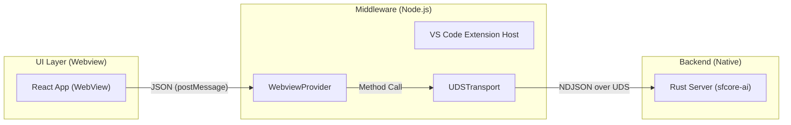
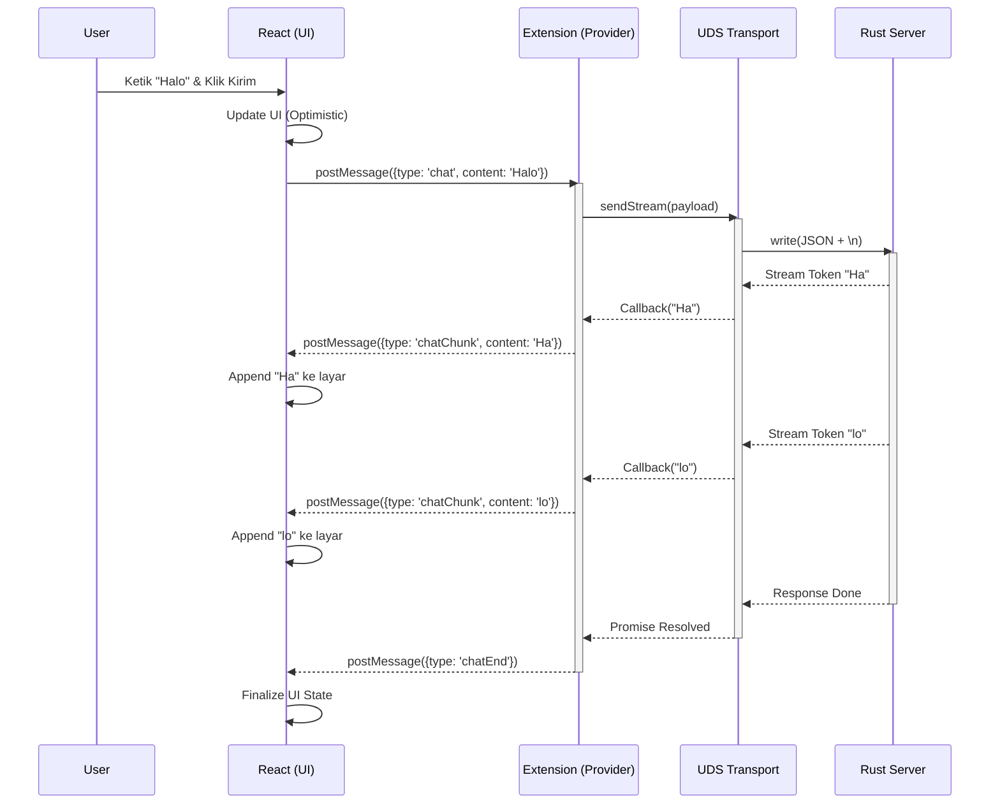
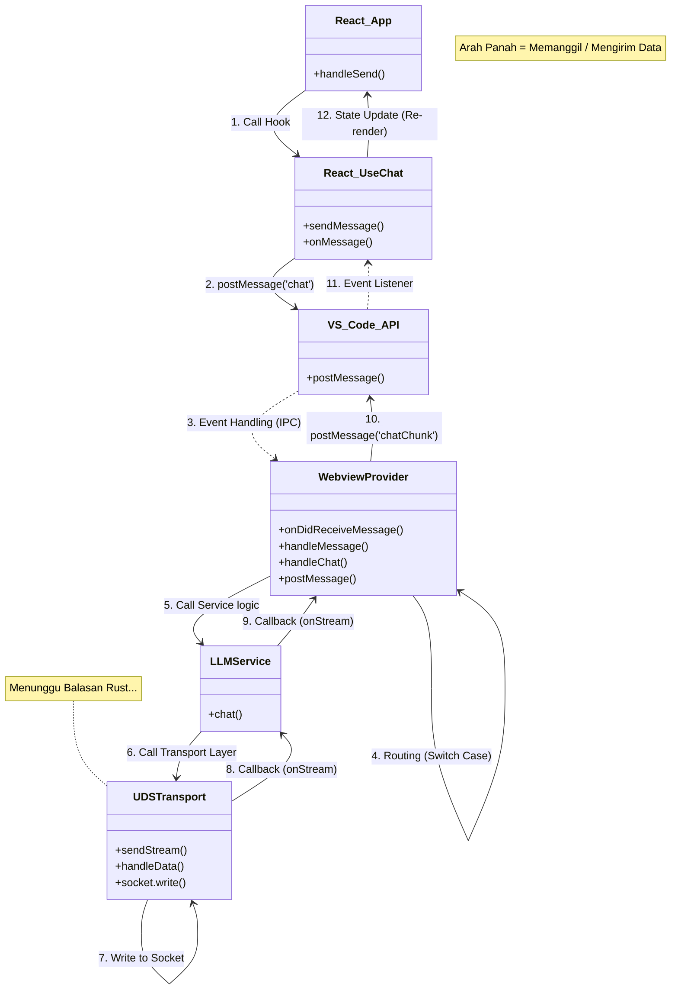

# Dokumentasi Arsitektur & Interaksi React-Rust (Edisi Developer .NET)

Dokumentasi ini dirancang khusus untuk Developer C#/.NET yang ingin memahami bagaimana `sfcore-extension` bekerja, mulai dari antarmuka React hingga backend Rust berkinerja tinggi.

## 1. Konsep Dasar: React vs .NET

Sebelum masuk ke kode, mari kita samakan frekuensi dengan beberapa analogi.

| Konsep React | Analogi .NET (WPF/WinForms/ASP.NET) | Penjelasan Singkat |
| :--- | :--- | :--- |
| **Component** (`App.tsx`, `ChatPanel`) | **UserControl** / **Partial View** | Blok UI yang reusable dan terisolasi. Menerima data lewat `props` (mirip Constructor Params). |
| **Props** | **Constructor Arguments** / **Dependency Property** | Data yang dikirim dari Parent ke Child. Read-only di sisi Child. |
| **State** (`useState`) | **ViewModel Property (INotifyPropertyChanged)** | Data internal komponen. Jika berubah, UI otomatis rereder (mirip Binding). |
| **Hooks** (`useChat`, `useEffect`) | **Service / Behavior** | Logika bisnis yang di-encapsulate bisa dipanggil di komponen mana saja. |
| **Context** | **Dependency Injection (Scoped)** | Cara berbagi data global (seperti Theme atau Auth) tanpa oper-oper props manual. |

## 2. Arsitektur High-Level

Aplikasi ini menggunakan arsitektur **3-Tier** yang berjalan secara lokal di mesin pengguna:



1.  **UI Layer (React)**: Berjalan di dalam sandbox `iframe` (Webview VS Code). Tidak punya akses langsung ke file system atau OS.
2.  **Middleware (TypeScript)**: Berjalan di proses Extension Host VS Code. Bertindak sebagai "Controller" yang menjembatani UI dan OS/Backend.
4.  **Backend (Rust)**: Proses terpisah (Daemon) yang menangani komputasi berat (AI Inference). Berkomunikasi lewat Unix Domain Socket (UDS).

> [!IMPORTANT]
> **Kenapa React tidak langsung tembak UDS/Rust?**
> Karena **Security Sandbox**.
> Webview di VS Code itu seperti tab browser Chrome yang terisolasi. Dia **DILARANG** mengakses File System, Network Socket (selain WebSocket/HTTP standard), atau memanggil Native Process.
>
> Itulah kenapa kita butuh **Extension Host (Node.js)** sebagai "Jembatan/Broker".
> *   React minta tolong Node.js ("Eh, kirimin ini ke Rust dong").
> *   Node.js (yang punya akses OS penuh) meneruskan pesan ke Rust via Socket.


## 3. Bedah Kode: React Frontend (`src/webview`)

Fokus utama kita adalah bagaimana React mengirim pesan "Chat" ke Extension.

### 3.1. Struktur Komponen
Komponen utama ada di `src/webview/App.tsx`. Ini mirip dengan `MainWindow.xaml` atau `App.razor`.

```tsx
// src/webview/App.tsx
export const App: React.FC = () => {
    // State management (mirip ViewModel)
    const { messages, sendMessage } = useChat(mode); 

    // Event Handler (mirip ICommand execute)
    const handleSend = (msg) => sendMessage(msg);

    return (
        <div className="app">
             {/* Data binding messages ke ChatPanel */}
            <ChatPanel messages={messages} onSend={handleSend} />
        </div>
    );
};
```

### 3.2. Abstraksi Logika: `useChat` Hook
Logika komunikasi diisolasi di `src/webview/hooks/useChat.ts`. Ini adalah "Service Layer" di sisi Frontend.

**Komunikasi Keluar (Request):**
React menggunakan `vscodeApi.postMessage` untuk mengirim data ke Extension. Ini mirip dengan melakukan HTTP Call atau gRPC call, tapi transport-nya disediakan oleh VS Code.

```typescript
// useChat.ts - Sending Message
const sendMessage = useCallback((content: string) => {
    // 1. Update UI Optimistic (langsung tampilkan pesan user)
    setMessages((prev) => [...prev, { role: 'user', content }]);

    // 2. Kirim payload ke "Backend" (Extension Host)
    vscodeApi.postMessage({
        type: 'chat', // Action/Method Name
        payload: {    // DTO (Data Transfer Object)
            messages: [...messages, userMessage],
            mode,
        },
    });
}, ...);
```

**Komunikasi Masuk (Response):**
React mendengarkan event global `message` dari window. Ini mirip dengan `Socket.On("message")` atau `EventAggregator`.

```typescript
// useChat.ts - Receiving Message
useEffect(() => {
    const handleMessage = (event: MessageEvent) => {
        const message = event.data;
        
        // Routing berdasarkan tipe pesan (Switch Case sebagai router)
        switch (message.type) {
            case 'chatChunk': // Streaming response
                setCurrentResponse((prev) => prev + message.payload.content);
                break;
            case 'chatEnd':   // Selesai
                setIsLoading(false);
                break;
        }
    };

    window.addEventListener('message', handleMessage);
    return () => window.removeEventListener('message', handleMessage); // Dispose/Unsubscribe
}, ...);
```

## 4. Bedah Kode: Extension Backend (`src/extension`)

Ini adalah sisi "Server" bagi React, tapi "Client" bagi Rust. Ditulis dalam TypeScript.

### 4.1. Controller: `WebviewProvider.ts`
Kelas `WebviewProvider` bertindak sebagai Controller. Ia menerima pesan dari React dan memanggil service yang sesuai.

```typescript
// WebviewProvider.ts
export class WebviewProvider implements vscode.WebviewViewProvider {
    // Entry point saat React mengirim pesan
    private async handleMessage(message: MessageFromWebview): Promise<void> {
        switch (message.type) {
            case 'chat':
                await this.handleChat(message.payload);
                break;
            // ... case lain
        }
    }

    private async handleChat(payload: any): Promise<void> {
        // Panggil Business Logic (LLMService)
        await this.llmService.chat(payload.messages, {
            onStream: (chunk) => {
                // Kirim balik partial response ke React
                this.postMessage({ type: 'chatChunk', payload: { content: chunk } });
            }
        });
    }
}
```

### 4.2. Business Logic: `LLMService.ts`
Service ini membungkus logika pemanggilan ke backend Rust. Ia tidak peduli apakah backend-nya HTTP atau Socket.

```typescript
// LLMService.ts
async chat(messages: ChatMessage[], options: ...): Promise<ChatResponse> {
    // Memanggil Transport Layer
    await this.transport.sendStream({ 
        type: 'chat', 
        payload: { messages, ... } 
    }, (chunk) => {
        options.onStream!(chunk);
    });
}
```

### 4.3. Infrastructure: `UDSTransport.ts`
Disini terjadi komunikasi fisik ke Rust menggunakan **Unix Domain Socket (UDS)**. Ini jauh lebih cepat daripada HTTP localhost karena tidak ada overhead TCP/IP stack.

Format protokolnya adalah **NDJSON** (Newline Delimited JSON). Setiap baris adalah satu objek JSON valid.

```typescript
// UDSTransport.ts
async send(message: TransportMessage): Promise<TransportResponse> {
    // Membuka koneksi socket ke file /tmp/sfcore-ai.sock
    this.socket = net.createConnection(this.socketPath);
    
    // Serialisasi Request ke JSON string + Newline
    const jsonLine = JSON.stringify(request) + '\n';
    this.socket.write(jsonLine);
}
```

## 5. Backend Server Rust (`sfcore-ai`)

Server Rust (`crates/server/src/main.rs`) adalah worker utama yang memuat model AI ke RAM.

### Alur Kerja Rust Server:
1.  **Startup**: Membaca `server_config.toml` dan memuat model GGUF ke memori (menggunakan `llama.cpp` binding).
2.  **Listening**: Membuka Unix Domain Socket di `/tmp/sfcore-ai.sock`.
3.  **Loop**: Menerima koneksi, membaca line JSON, menjalankan inferensi, dan streaming token balik ke socket.

Konfigurasi (`server_config.toml`):
```toml
model = "./models/Qwen3-0.6B-UD-Q5_K_XL.gguf"
socket = "/tmp/sfcore-ai.sock"
threads = 3
```

---

## 6. Diagram Alur Lengkap (Sequence Diagram)

Berikut adalah diagram urutan (Sequence Diagram) yang menggambarkan perjalanan satu pesan "Halo" dari user sampai mendapat balasan.



## Ringkasan untuk Developer .NET

1.  **Frontend (React)** hanyalah View "bodoh" yang merender JSON array menjadi Chat UI. Ia tidak punya logika bisnis berat.
2.  **Extension (TS)** bertindak sebagai **API Gateway** lokal. Ia validasi request, kelola state file, dan routing ke backend.
3.  **Rust Server** adalah **Microservice** (atau Windows Service) yang melakukan kerja berat.
4.  **Komunikasi** menggunakan pola **Duplex Stream**: Request dikirim sekali, Response diterima berpotong-potong (chunk) secara real-time.

---

## 7. Bedah Alur Code (Code Call Graph)

Bagian ini mendetailkan perjalanan eksekusi kode **Method-per-Method**. Ini adalah "Stack Trace" versi dokumentasi agar Anda tahu persis file mana memanggil file mana.

Kita ambil studi kasus: **User mengirim pesan "Buatkan fungsi login"**.

### Keterangan Simbol
*   `[React]` = Sisi UI (Frontend)
*   `[Ext]` = Sisi Extension Host (Backend Node.js)
*   `->` = Pemanggilan Fungsi (Synchronous/Async)
*   `~>` = Pengiriman Pesan (IPC / Cross-Process)

---

### Langkah 1: UI Trigger (React)

1.  **File**: `src/webview/App.tsx`
    *   **Method**: `handleSend(message)`
    *   **Action**: User menekan tombol kirim. Fungsi ini memanggil hook.
    *   **Code**: `sendMessage(message)`

2.  **File**: `src/webview/hooks/useChat.ts`
    *   **Method**: `sendMessage(content)`
    *   **Action**: 
        1.  Update State `messages` (tambah pesan user ke UI).
        2.  Kirim pesan lintas proses ke Extension Host.
    *   **Code**: 
        ```typescript
        vscodeApi.postMessage({ 
            type: 'chat', 
            payload: { messages: [...], mode: 'normal' } 
        });
        ```

---

### Langkah 2: Routing Pesan (Extension Host)

3.  **File**: `src/extension/providers/webviewProvider.ts`
    *   **Method**: `constructor` -> `webviewView.webview.onDidReceiveMessage`
    *   **Action**: Event listener menangkap pesan JSON dari React.
    *   **Call**: `this.handleMessage(message)`

4.  **File**: `src/extension/providers/webviewProvider.ts`
    *   **Method**: `handleMessage(message)`
    *   **Action**: Switch-case untuk menentukan tipe pesan (`chat`, `addFile`, dll).
    *   **Call**: `this.handleChat(message.payload)` untuk tipe `'chat'`.

5.  **File**: `src/extension/providers/webviewProvider.ts`
    *   **Method**: `handleChat(payload)`
    *   **Action**: Menyiapkan context file, lalu memanggil Business Logic Service.
    *   **Code**: `await this.llmService.chat(payload.messages, { onStream: ... })`

---

### Langkah 3: Business Logic & Transport

6.  **File**: `src/extension/services/llmService.ts`
    *   **Method**: `chat(messages, options)`
    *   **Action**: Membungkus request menjadi format yang dimengerti Transport layer.
    *   **Call**: `this.transport.sendStream(request, callback)`

7.  **File**: `src/extension/transport/udsTransport.ts`
    *   **Method**: `sendStream(message, onChunk)`
    *   **Action**: 
        1.  Serialisasi objek JSON.
        2.  Tulis ke Socket Stream (Unix Domain Socket).
    *   **Code**: `this.socket.write(JSON.stringify(req) + '\n')`

---

### Langkah 4: Balikan Data (Callback Flow)

Saat Rust mengirim token balasan (misal kata "Tentu"), alurnya berbalik:

8.  **File**: `src/extension/transport/udsTransport.ts`
    *   **Method**: `socket.on('data')` -> `handleData(data)`
    *   **Action**: Menerima raw string dari socket, parse JSON.
    *   **Call**: `this.streamCallback(response.token)`

9.  **File**: `src/extension/services/llmService.ts`
    *   **Method**: `(anonymous callback)`
    *   **Action**: Meneruskan chunk dari transport ke service caller.
    *   **Call**: `options.onStream(chunk)`

10. **File**: `src/extension/providers/webviewProvider.ts`
    *   **Method**: `(anonymous callback)`
    *   **Action**: Meneruskan chunk kembali ke React via IPC.
    *   **Code**: `this.postMessage({ type: 'chatChunk', payload: { content: chunk } })`

11. **File**: `src/webview/hooks/useChat.ts`
    *   **Method**: `window.addEventListener('message')`
    *   **Action**: Menangkap event `chatChunk` dan update React State `setCurrentResponse`. UI otomatis re-render per huruf.

---

### Diagram Call Graph (Visual)


